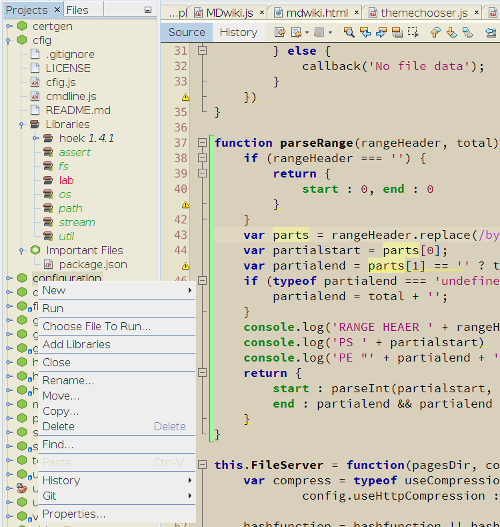
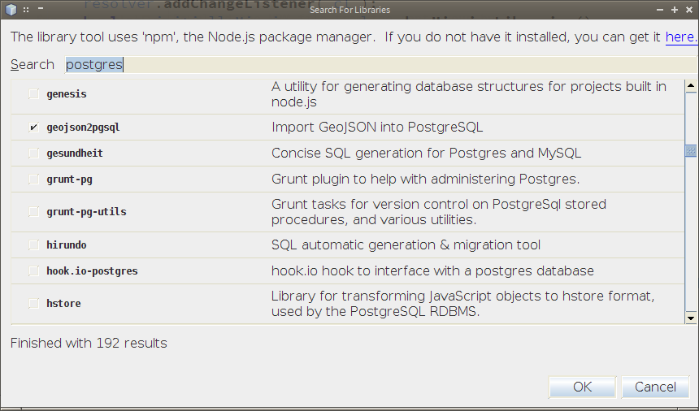

NetBeans NodeJS Plugin
======================

NodeJS support for NetBeans, originally hosted on netbeans.org.

Provides a project type and support for running [NodeJS](nodejs.org) 
projects and files in the [NetBeans](http://netbeans.org) IDE.

Features
--------

   * A NodeJS project type which uses Node's built-in
     metadata: Any folder with a  ``package.json`` file is a project
   * Support for running projects or individual files in Node
   * Detects dependencies by scanning sources, understands and can update 
     ``package.json`` metadata
   * Support for searching for libraries and adding them to a project (using ``npm`` under the hood)
   * Clickable stack traces in the output window
       * Ability to download and open NodeJS's sources as links in a stack trace
   * Allows the IDE to recognize scripts beginning with
       ``#!/usr/bin/env node``
     as Javascript sources
   * Detects and installs missing libraries

See [this blog](http://timboudreau.com/blog/read/NetBeans_Tools_for_Node_js)
for a broader description of the project.

Requirements
------------

   * NodeJS > 0.6.0
   * npm - Node Package Manager (if you have a recent version of NodeJS, you have it)
   * Java 7 or greater

The plugin will function without Node installed, but is not very useful.

Recent NetBeans builds have a rewritten Javascript editor with much better code completion
which works with NodeJS.  Get a [daily build](http://bits.netbeans.org/download/trunk/nightly/latest/)
or version [7.3](https://netbeans.org/downloads/index.html) or later for the best experience.

Installation
------------

Get it from [this NetBeans update server](http://timboudreau.com/modules) - see the instructions, OR

Download the NBM file from the continuous build
<a href="http://timboudreau.com/builds/job/NetBeans-NodeJS-Plugin/lastSuccessfulBuild/">on 
timboudreau.com</a>.  It will be named ``nodejs-$VERSION.nbm``.

install it using Tools | Plugins, on the Downloaded tab, in the IDE.
Longer term, it will be available from the standard NetBeans update 
center, so no separate download will be needed.

Supported Platforms
-------------------

This plugin was originally written before Node supported MS Windows.  Windows is recently
supported, and should work.  Please [file bugs](https://github.com/timboudreau/nb-nodejs/issues?state=open) if there are problems - your humble author is not
a Windows user, but is happy to fix anything that doesn't work.

Building
--------
The plugin is built using [Maven](http://mojo.codehaus.org/nbm-maven/nbm-maven-plugin/):

    cd node-projects
    mvn install nbm:nbm

Projects In This Repository
---------------------------

The main NodeJS plugin is the [node-projects](node-projects) plugin.  There is also the skeleton of a Node platform
for the Java/Nashorn-based AvatarJS project, which is still embryonic, and pending projects to develop code completion.

License
-------
Sources are licensed under the [MIT license](http://en.wikipedia.org/wiki/MIT_License), 
which amounts to: Do what you want with it but give credit where credit is due.

The original sources are available in the history of the 
[netbeans.org contrib repository](http://hg.netbeans.org/main/contrib).
They were moved here because netbeans.org's process for approving using 
third-party libraries was slowing down development.  Such restrictions
exist for good reason, but hosting elsewhere and using a more broadly
compatible license was the most expedient solution.  As the sole contributor
and joint copyright holder, I can relicense it, so I did.

